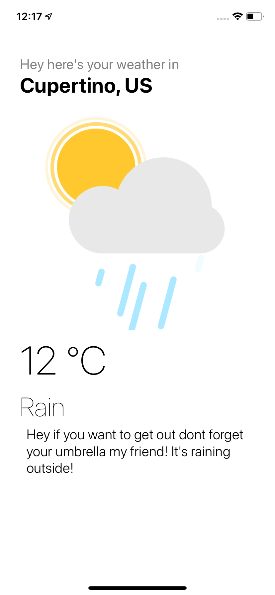

  <h1 align="center">My Weather React Native App</h1>
  <h2 align="center">A simple react native app made entirely with TS and consumes the open weather API </h1>

### Usage

To run this project use the following commands 

<pre align="center">yarn install or npm install</pre>
<pre align="center">react-native run-ios</pre>

### Includes

- [x] TypeScript
- [x] React Native
- [x] Redux Saga
- [x] Tslint
- [x] Styled Components
- [x] React Navigation

### ScreenShot

